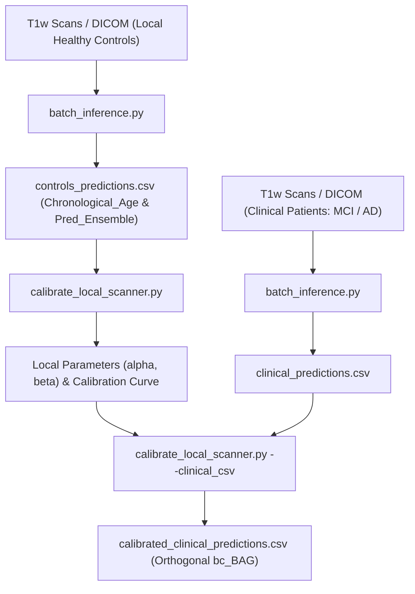

# User Guide: Local Age Bias Calibration for External MRI Scanners

This guide outlines the standard protocol to calibrate the **Brain Age Gap (BAG)** model to local external scanners using a reference cohort of **Cognitively Normal (CN) healthy controls**.

The purpose of this calibration is to eliminate the systematic regression-to-the-mean age bias and compensate for scanner/sequence-specific offsets. This ensures that the calibrated metric (`bc-BAG`) is orthogonal to chronological age ($r = 0.000$), preventing false positives and false negatives in clinical practice.

---

## 3-Step Calibration Workflow



---

## Step 1: Batch Inference on Control Cohort (Raw BAG)

Run batch inference on the directory containing scans of your local healthy controls (NIfTI files or DICOM series):

```bash
python batch_inference.py \
    --input_dir /path/to/healthy_controls_scans/ \
    --output_csv ./controls_predictions.csv \
    --output_dir ./controls_outputs
```

*Note:* If using NIfTI volumes where age is not present in the header, you can provide an input CSV with `input_t1` and `age` columns:
```bash
python batch_inference.py \
    --input_csv /path/to/controls_metadata.csv \
    --output_csv ./controls_predictions.csv
```

The resulting `controls_predictions.csv` contains the required fields:
* `Chronological_Age`: Subject chronological age at scan time.
* `Pred_Ensemble`: Brain age predicted by the triplanar ensemble.
* `Raw_BAG`: Raw gap metric ($	ext{Pred\_Ensemble} - 	ext{Chronological\_Age}$).

---

## Step 2: Fit Local Calibration Parameters

Run the calibration script passing the healthy controls CSV from Step 1:

```bash
python calibrate_local_scanner.py \
    --controls_csv ./controls_predictions.csv \
    --output_dir ./calibration_results
```

### Generated Artifacts:
1. **`local_calibration_parameters.csv`**:
   * $lpha$ (**alpha / Slope**): Regression-to-the-mean rate of the model.
   * $eta$ (**beta / Intercept**): Scanner-specific systematic offset.
2. **`local_calibration_curve.png`**:
   * Comparative scatter plot showing pre-calibration ($r \neq 0$) versus post-calibration ($r = 0.000$, orthogonalized) distributions.

---

## Step 3: Bias-Correct the Local Clinical Cohort (MCI, AD, etc.)

Once the scanner-specific coefficients $lpha$ and $eta$ are fitted, apply the calibration to your clinical patient cohort acquired on the same scanner:

```bash
# 1. Run inference on clinical cohort
python batch_inference.py \
    --input_dir /path/to/clinical_patients_scans/ \
    --output_csv ./clinical_predictions.csv

# 2. Apply calibration and compute bc-BAG
python calibrate_local_scanner.py \
    --controls_csv ./controls_predictions.csv \
    --clinical_csv ./clinical_predictions.csv \
    --output_dir ./calibration_results
```

The output file `calibration_results/calibrated_clinical_predictions.csv` contains the bias-corrected metric:
$$\text{bc-BAG} = \text{Raw\_BAG} - (\alpha \cdot \text{Chronological\_Age} + \beta)$$

---

## Clinical Interpretation of `bc-BAG`

* **$	ext{bc-BAG} \approx 0$ years:** Normative brain aging aligned with chronological age.
* **$	ext{bc-BAG} > +3.0$ to $+5.0$ years:** Biologically accelerated brain aging (associated with neurodegenerative atrophy, accelerated conversion from MCI to AD, and higher amyloid/tau burden).
* **$	ext{bc-BAG} < -3.0$ years:** Resilient brain aging / structural preservation.
