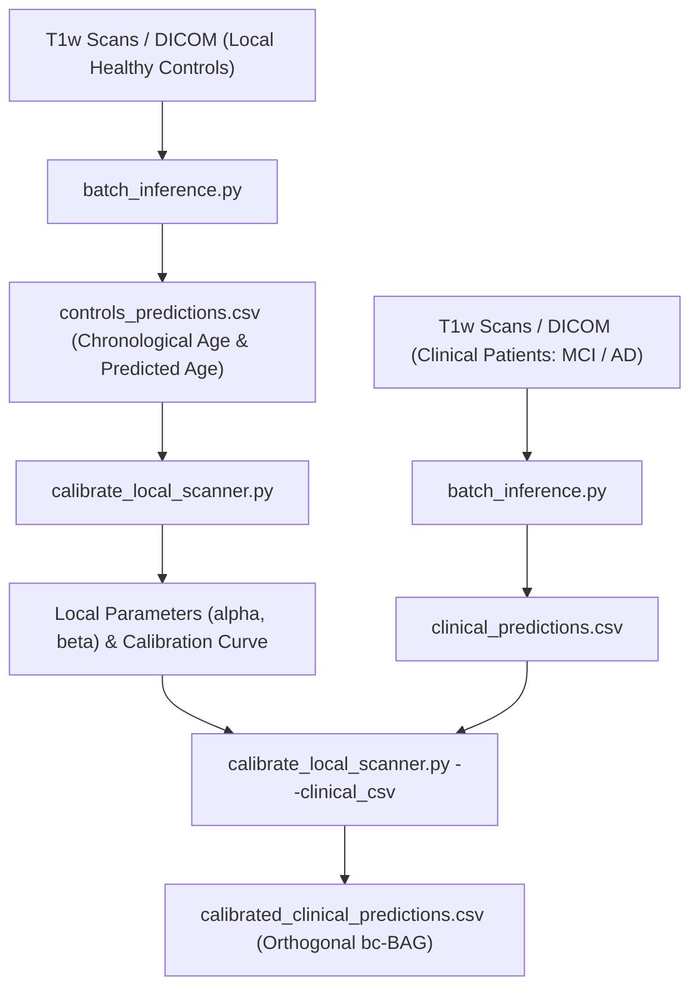

# User Guide: Local Age Bias Calibration for External MRI Scanners

This guide outlines the standard protocol to calibrate the **Brain Age Gap (BAG)** model to local external scanners using a reference cohort of **Cognitively Normal (CN) healthy controls**.

The purpose of this calibration is to eliminate systematic regression-to-the-mean age bias and compensate for scanner- or sequence-specific contrast offsets. This ensures that the calibrated metric (`bc-BAG`) is orthogonalized with respect to chronological age (Pearson correlation r = 0.000), preventing age-dependent false positives and false negatives in downstream clinical/research analysis.

---

## 3-Step Calibration Workflow



---

## Methodological Guidelines: Sample Size & Cadence

### 1. Recommended Sample Size (N)
* **Minimum threshold:** N >= 30 healthy control subjects.
* **Ideal cohort size:** N >= 50 (or more) healthy controls.
* **Age distribution:** Controls should span the age range of the clinical study (e.g., ages 50 to 85 for dementia studies) with balanced representation across age bins.

### 2. When to Re-Calibrate
* **Periodic Updates:** Re-run calibration whenever a new batch of >= 50-100 healthy control scans is acquired at the local site.
* **Hardware/Software Upgrades:** Re-calibrate whenever scanner software is updated, receive coils are replaced, or sequence acquisition parameters (TE, TR, flip angle, voxel geometry) are altered.

---

## Step 1: Batch Inference on Control Cohort (Raw BAG)

Run batch inference on the directory containing scans of your local healthy controls (NIfTI files or DICOM series):

```bash
python batch_inference.py \
    --input_dir /path/to/healthy_controls_scans/ \
    --output_csv ./controls_predictions.csv \
    --output_dir ./controls_outputs
```

*Note:* If using NIfTI volumes where age is not present in the header, you can provide an input CSV with `input_t1` and `age` columns:
```bash
python batch_inference.py \
    --input_csv /path/to/controls_metadata.csv \
    --output_csv ./controls_predictions.csv
```

The resulting `controls_predictions.csv` contains the required fields:
* `Chronological_Age`: Subject chronological age at scan time.
* `Pred_Ensemble`: Brain age predicted by the triplanar ensemble.
* `Raw_BAG`: Raw gap metric (`Predicted Age - Chronological Age`).

---

## Step 2: Fit Local Calibration Parameters

Run the calibration script passing the healthy controls CSV from Step 1:

```bash
python calibrate_local_scanner.py \
    --controls_csv ./controls_predictions.csv \
    --output_dir ./calibration_results
```

### Generated Artifacts:
1. **`local_calibration_parameters.csv`**:
   * **alpha (Slope)**: Regression-to-the-mean rate of the model.
   * **beta (Intercept)**: Scanner-specific systematic offset in years.
   * **Pearson r**: Correlation with age before and after calibration.
2. **`local_calibration_curve.png`**:
   * Comparative scatter plot showing pre-calibration (correlated with age) versus post-calibration (r = 0.000, orthogonalized) distributions.

---

## Step 3: Bias-Correct the Local Clinical Cohort (MCI, AD, etc.)

Once the scanner-specific coefficients alpha and beta are fitted, apply the calibration to your clinical patient cohort acquired on the same scanner:

```bash
# 1. Run inference on clinical cohort
python batch_inference.py \
    --input_dir /path/to/clinical_patients_scans/ \
    --output_csv ./clinical_predictions.csv

# 2. Apply calibration and compute bc-BAG
python calibrate_local_scanner.py \
    --controls_csv ./controls_predictions.csv \
    --clinical_csv ./clinical_predictions.csv \
    --output_dir ./calibration_results
```

The output file `calibration_results/calibrated_clinical_predictions.csv` contains the bias-corrected metric:
```
bc-BAG = Raw BAG - (alpha * Chronological Age + beta)
```

---

## Interpretation of Calibrated Metrics

* **`bc-BAG ~ 0.0 years`**: Normative brain appearance aligned with chronological age.
* **`bc-BAG > +3.0 to +5.0 years`**: Biologically accelerated brain aging (associated with neurodegenerative atrophy, accelerated conversion from MCI to AD, and higher biomarker burden).
* **`bc-BAG < -3.0 years`**: Structural brain preservation / resilience.
