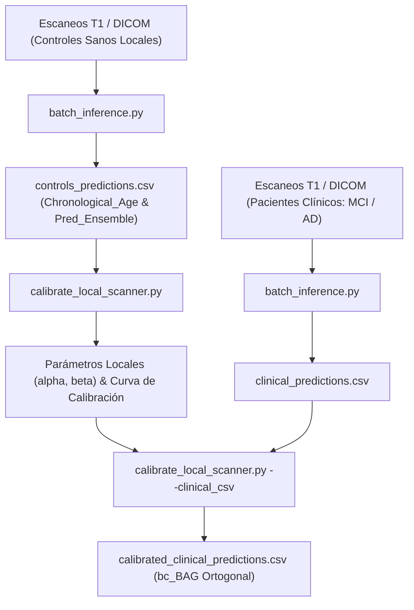

# Guía de Uso: Calibración Local del Sesgo de Edad para Resonadores Externos

Esta guía detalla el procedimiento estándar para calibrar el modelo de **Edad Cerebral (Brain Age Gap, BAG)** a resonadores locales externos utilizando una cohorte local de **Controles Cognitivamente Normales (CN)**.

El objetivo de esta calibración es eliminar el sesgo sistemático por edad (efecto de regresión a la media) y ajustar el offset específico del escáner/secuencia, garantizando que el `bc-BAG` sea completamente ortogonal a la edad cronológica ($r = 0.000$) y previniendo falsos positivos o negativos en la práctica clínica.

---

## 📋 Flujo de Trabajo en 3 Pasos



---

## Paso 1: Inferencia en Lote de la Cohorte Control (Raw BAG)

Ejecuta la inferencia en lote sobre la carpeta que contiene las resonancias de tus controles sanos locales (archivos NIfTI o DICOMs):

```bash
python batch_inference.py \
    --input_dir /ruta/a/resonancias_controles_sanos/ \
    --output_csv ./controls_predictions.csv \
    --output_dir ./controls_outputs
```

*Nota:* Si utilizas volúmenes NIfTI donde la edad no está en la cabecera, puedes pasar un CSV con las columnas `input_t1` y `age`:
```bash
python batch_inference.py \
    --input_csv /ruta/a/metadatos_controles.csv \
    --output_csv ./controls_predictions.csv
```

El archivo `controls_predictions.csv` contendrá las columnas requeridas:
* `Chronological_Age`: Edad real del sujeto al momento del escaneo.
* `Pred_Ensemble`: Edad cerebral estimada por el ensamble triplanar.
* `Raw_BAG`: Brecha cruda ($\text{Pred\_Ensemble} - \text{Chronological\_Age}$).

---

## Paso 2: Ajuste de la Calibración Local

Ejecuta el script de calibración pasando el CSV de controles sanos obtenido en el Paso 1:

```bash
python calibrate_local_scanner.py \
    --controls_csv ./controls_predictions.csv \
    --output_dir ./calibration_results
```

### Resultados Generados:
1. **`local_calibration_parameters.csv`**:
   * $\alpha$ (**alpha / Pendiente**): Tasa de regresión a la media del modelo.
   * $\beta$ (**beta / Intercepto**): Offset sistemático específico del resonador local.
2. **`local_calibration_curve.png`**:
   * Gráfico comparativo de dispersión pre-calibración ($r \neq 0$) vs post-calibración local ($r = 0.000$, ortogonalizado).

---

## Paso 3: Corrección de la Cohorte Clínica Local (MCI, AD, etc.)

Una vez obtenidos los coeficientes $\alpha$ y $\beta$ del resonador, puedes corregir directamente tu cohorte de pacientes clínicos escaneados en el mismo equipo:

```bash
# 1. Inferencia de la cohorte clínica
python batch_inference.py \
    --input_dir /ruta/a/resonancias_pacientes_clinicos/ \
    --output_csv ./clinical_predictions.csv

# 2. Calibración y exportación de la métrica corregida bc-BAG
python calibrate_local_scanner.py \
    --controls_csv ./controls_predictions.csv \
    --clinical_csv ./clinical_predictions.csv \
    --output_dir ./calibration_results
```

El archivo resultante `calibration_results/calibrated_clinical_predictions.csv` incluirá la métrica clínica fundamental:
$$\text{bc-BAG} = \text{Raw\_BAG} - (\alpha \cdot \text{Chronological\_Age} + \beta)$$

---

## 💡 Interpretación Clínica de `bc-BAG`

* **`bc-BAG \approx 0` años:** Envejecimiento cerebral normativo concordante con la edad cronológica.
* **`bc-BAG > +3.0` a `+5.0` años:** Envejecimiento cerebral biológicamente acelerado (asociado a atrofia neurodegenerativa, conversión temprana de MCI a AD y mayor carga patológica amiloide/tau).
* **`bc-BAG < -3.0` años:** Envejecimiento cerebral resiliente / preservación estructural.
