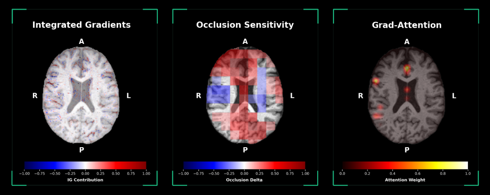

# Brain Age Prediction (In-House Model & Explainable AI Framework)

<p align="center">
  
</p>

[](https://www.python.org/downloads/release/python-3100/)
[](https://pytorch.org/)
[](https://github.com/nicolasfuents/brain-age-pred-InHouse-model/releases/tag/v1.0.0)
[]()

This repository provides an end-to-end framework for **Brain Age Gap (BAG)** estimation, local scanner calibration, and feature attribution via **Explainable AI (XAI)** maps from structural T1-weighted MRI (supporting **DICOM** folders/archives, **NIfTI** volumes, and preprocessed PyTorch **`.pt`** tensors).

The model implements an optimized 2.5D architecture operating on only 5 representative slices per anatomical plane (axial, coronal, and sagittal). As a result, neural network inference is extremely fast and lightweight (~0.55 seconds per volume on GPU). The primary computational workload resides in the preprocessing stage (affine alignment to MNI152 and N4 bias field correction).

---

## Table of Contents

- [Installation & Requirements](#installation--requirements)
- [Usage Guide](#usage-guide)
  - [1. Single-Subject Fast Inference](#1-single-subject-fast-inference-run_pipelinepy)
  - [2. Full Inference with Explainable AI](#2-full-inference-with-explainable-ai---all)
  - [3. Large-Scale Batch Inference](#3-large-scale-batch-inference-batch_inferencepy)
  - [4. High-Throughput Batch Preprocessing](#4-high-throughput-batch-preprocessing-batch_preprocesspy)
  - [5. Local Scanner Calibration](#5-local-scanner-calibration-calibrate_local_scannerpy)
- [Model Interpretability Methods (XAI)](#model-interpretability-methods-xai-with---all)
- [Pipeline Outputs](#pipeline-outputs)
- [Performance & Benchmark](#performance--benchmark)
- [Disclaimer](#disclaimer)

---

## Installation & Requirements

### 1. Clone the repository
```bash
git clone https://github.com/nicolasfuents/brain-age-pred-InHouse-model.git
cd brain-age-pred-InHouse-model
```

### 2. Create and activate the Conda environment
```bash
conda env create -f environment.yml
conda activate brain_age_env
```

### 3. External Neuroimaging Dependencies (Preprocessing Pipeline)

To ensure maximum anatomical fidelity and reproducibility, raw MRI scans (DICOM or native NIfTI) must be processed through the standardized `src/preprocessing/` pipeline (identical to the training cohort preprocessing). This requires the following standard neuroimaging tools in your system `PATH`:

* **FSL** (tested with `v6.0.7.18`, compatible with `v6.0+`): `flirt`, `fslreorient2std`, `fslmaths` for 12-DOF affine registration and masking to MNI152 (1mm).
* **ANTs** (tested with `v2.6.2`, compatible with `v2.4+`): `N4BiasFieldCorrection` for B-spline non-parametric bias field correction.
* **FreeSurfer / SynthStrip** (tested with `v7.4.1`, compatible with `v7.0+`): `mri_synthstrip` for deep-learning intracranial skull stripping and brain mask generation.
* **dcm2niix** (tested with `v1.0.20230411`): High-performance DICOM-to-NIfTI conversion.
* **BrainPrep** (`v0.0.2`, CEA NeuroSpin): Quasiraw affine workflow automation (installed via `environment.yml`).

*Fast Inference Optimization (`--skip-prep`):*
If your volumes are already preprocessed, you can pass `--skip-prep` to bypass external neuroimaging tools and run inference directly using only Python and PyTorch.

---

## Usage Guide

### 1. Single-Subject Fast Inference (`run_pipeline.py`)
```bash
# Inference from DICOM (automatically extracts age from header):
python run_pipeline.py --input_dicom /path/to/DICOM_study/

# Inference from raw T1w NIfTI volume (runs automated SynthStrip + FLIRT + N4):
python run_pipeline.py --input_t1 /path/to/T1w_volume.nii.gz --age 68.5

# Direct inference on preprocessed MNI volume (skips registration and N4):
python run_pipeline.py --input_t1 /path/to/preprocessed_MNI_volume.nii.gz --age 68.5 --skip-prep
```

### 2. Full Inference with Explainable AI (`--all`)
```bash
# Inference + Integrated Gradients, Occlusion Sensitivity, Grad-Attention & Visual Explanation Panel:
python run_pipeline.py --input_t1 /path/to/T1w_volume.nii.gz --age 68.5 --all
```

### 3. Large-Scale Batch Inference (`batch_inference.py`)
Designed for high-throughput automated processing of extensive research cohorts and neuroimaging databases (supporting directories of NIfTI volumes, pre-extracted `.pt` tensors, or raw DICOM folders/zips):
```bash
# High-throughput batch processing across a full cohort directory:
python batch_inference.py \
    --input_dir /path/to/cohort_scans_directory/ \
    --output_csv ./cohort_predictions.csv

# Fast batch inference on pre-registered MNI datasets:
python batch_inference.py \
    --input_dir /path/to/preprocessed_datasets/ \
    --output_csv ./cohort_predictions.csv \
    --skip-prep
```

### 4. High-Throughput Batch Preprocessing (`batch_preprocess.py`)
Preprocesses an entire cohort of raw DICOMs or native NIfTI volumes in parallel, generating pre-aligned MNI152 volumes, 2.5D `.pt` tensors, and a manifest CSV ready for instant inference:
```bash
# Parallel batch preprocessing on raw scans folder:
python batch_preprocess.py \
    --input_dir /path/to/raw_scans_directory/ \
    --output_dir ./preprocessed_cohort \
    --n_jobs 8

# Batch preprocessing from a CSV file:
python batch_preprocess.py \
    --input_csv /path/to/cohort_manifest.csv \
    --output_dir ./preprocessed_cohort \
    --n_jobs 8
```

### 5. Local Scanner Calibration (`calibrate_local_scanner.py`)
Fits linear regression coefficients on a local Cognitively Normal (CN) healthy control cohort to eliminate regression-to-the-mean age bias and correct target study cohorts:
```bash
python calibrate_local_scanner.py \
    --controls_csv ./controls_predictions.csv \
    --clinical_csv ./clinical_predictions.csv \
    --output_dir ./calibration_results
```
*(See complete workflow in [HOWTO_CALIBRATION.md](HOWTO_CALIBRATION.md))*

---

## Model Interpretability Methods (XAI) with `--all`

When specifying the `--all` flag, the pipeline automatically generates 3 complementary visual explanation and feature attribution maps:

1. **Integrated Gradients (Signed IG):** Voxel-wise gradient path integration from a baseline to the input image, highlighting anatomical microstructures that positively (+) or negatively (-) contribute to predicted brain age.
2. **Occlusion Sensitivity:** Systematic sliding-patch perturbation mapping regional sensitivity across brain anatomy.
3. **Grad-Attention (Transformer Rollout):** Self-attention rollout gated by backpropagated gradients, isolating long-range anatomical patterns driving model predictions.

---

## Pipeline Outputs

* **`results.json` / `results.csv`:** Quantitative metrics including per-plane predictions, ensemble prediction, chronological age, `Raw_BAG`, and `bc_BAG` (calibrated).
* **`tensors/`:** Extracted and normalized 2.5D PyTorch tensors (`tensor_axial.pt`, `tensor_coronal.pt`, `tensor_sagittal.pt`).
* **`xai/<SUBJECT_ID>_xai_overlays_panel.png` (with `--all`):** High-resolution (300 DPI) visual explanation panel displaying T1 anatomy alongside all 3 XAI overlay maps for each orthogonal plane.

---

## Performance & Benchmark

Computation time and memory consumption are benchmarked across the pipeline stages:

| Stage | Evaluated Hardware | Time per Subject | Memory Footprint |
| :--- | :--- | :--- | :--- |
| **Triplanar Inference (3 Models + TTA)** | GPU (NVIDIA H100 80GB) | **~0.55 s** (~1.8 subjects/s) | **< 1.0 GB VRAM** (954 MB peak) |
| **Triplanar Inference (3 Models + TTA)** | CPU (AMD EPYC 9654) | **~10.8 s** | ~1.2 GB RAM |
| **Quasiraw Preprocessing (FLIRT + N4)** | CPU + GPU (SynthStrip on GPU) | **~40 – 50 s** | ~2.0 GB RAM |
| **Quasiraw Preprocessing (FLIRT + N4)** | CPU Only (Pure Host Execution) | **~55 – 75 s** | ~2.0 GB RAM |

*Note:* With an inference footprint under 1 GB VRAM, the models can run locally on standard entry-level consumer GPUs (e.g., laptop GTX 1650, RTX 3050) or CPU-only server instances.

---

## Disclaimer

This software and its associated models are designed solely for academic and neuroimaging research purposes (Research Use Only). This tool has not been certified or cleared as a medical device by any regulatory authority and is not intended for clinical diagnosis, prognosis, or medical decision-making.
